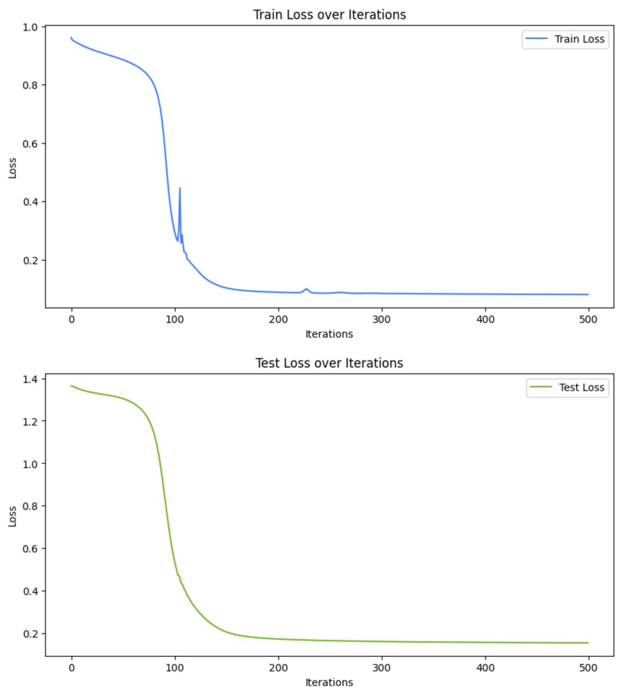
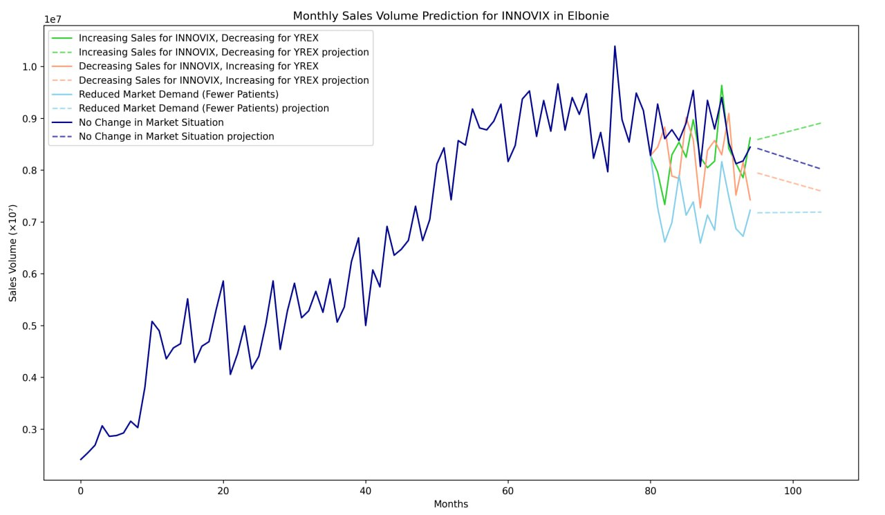

# Sales Prediction Using LSTM: Monthly Pharmaceutical Forecasting

## Overview

This project predicts monthly pharmaceutical sales for Innovix in Elbonie using an LSTM-based neural network. The model uses historical sales data and other relevant features to forecast future sales volumes. The solution ensures effective planning and resource allocation, helping to prevent medication shortages.

---

## Features
1. **Data Preprocessing**: Extracts relevant features from a dataset and converts them into tensors suitable for model input.
2. **LSTM Model**: A neural network trained to predict sales trends based on past performance.
3. **Reproducibility**: Ensures consistent results with fixed seeds for randomness.
4. **Visualization**: Plots the predicted sales for easier analysis and interpretation.

---

## How It Works

1. **Dataset**:
   - Input: Excel file (`IN_E_FULL.xlsx`) containing historical sales data and related features.
   - Features used: Sales data (`Value Innovix`, `Value Yrex`) and indications (e.g., `Indication 1`, `Indication 2`).

2. **Model**:
   - LSTM (Long Short-Term Memory) is employed for sequence prediction, as it excels in handling time-series data.

3. **Prediction**:
   - The model predicts the next 14 months of sales based on the latest 20 months of data.
   - The forecast is denormalized to return to the original scale.

4. **Visualization**:
   - Monthly sales trends are plotted to compare predicted values over time.

---

## Setup Instructions

### Prerequisites
- Python 3.8+
- Required Libraries: `pandas`, `torch`, `numpy`, `matplotlib`
- Dataset: Ensure `IN_E_FULL.xlsx` is in the `dataset2` folder.
- Pre-trained Model: Ensure `model_weights.pth` is in the `project` folder.

### Steps
1. Install dependencies:
   ```bash
   pip install pandas torch numpy matplotlib
   ```
2. Run the script:
   ```bash
   python predict_sales.py
   ```

---

## Code Breakdown

### Data Preprocessing
- Reads the Excel file and extracts the specified columns.
- Converts the data into PyTorch tensors for model compatibility.
- Prepares the last `context_size` months of data for prediction.

### Model Architecture
- **Input size**: 20 features per time step.
- **Hidden size**: 32 units in the LSTM layer.
- **Output size**: Predicts sales for the next 14 months.

### Prediction Workflow
1. Normalizes input data using the training mean and standard deviation.
2. Feeds the prepared data into the LSTM model.
3. Denormalizes the output to produce human-readable sales predictions.

### Visualization
- Combines historical and predicted sales data.
- Displays a line graph of monthly sales volumes.

---

## Example Output

- **Predicted Tensor Shape**: `(1, 20, 21)`
- **Predicted Sales (Next 14 Months)**: 
  ```plaintext
  [9507680, 8649920, 9342280, ...]
  ```
- **Sales Plot**:
  A graph showing trends over the months, with predictions extending beyond historical data.

---
# README for `train.py`

## Overview
`train.py` is a PyTorch-based script designed to train an LSTM model for monthly sales prediction. The model predicts sales volumes based on a dataset containing sales and indicator data. It normalizes the input, trains the LSTM on batches of data, and outputs the trained model weights and performance metrics.

## Features
- **Reproducibility**: Ensures deterministic results by setting seeds and fixing random behavior.
- **Data Normalization**: Normalizes input and target data to improve training stability.
- **Batch Training**: Utilizes a `DataLoader` for efficient batch training.
- **Model Saving**: Saves the trained model's weights for future inference.
- **Visualization**: Plots training and testing losses over epochs.

---

## Requirements
### Libraries
- Python 3.8 or higher
- PyTorch
- NumPy
- Matplotlib

### Dataset
- Input tensors are saved in `.pth` format:
  - `x_train_t2.pth`: Training features.
  - `y_true_t2.pth`: Training targets.
  - `predict_t2.pth`: Prediction features.

---

## Script Flow

### 1. **Model Definition**
An LSTM model (`SalesPredictionModel`) is defined with:
- Input layer for 20 features.
- LSTM layer with 32 hidden units.
- Fully connected layer producing predictions for 14 months.

### 2. **Data Preprocessing**
- Loads and normalizes training and prediction data.
- Adds a derived feature (`sum`) from the first two columns.

### 3. **Training**
- Loss: Mean Squared Error (MSE).
- Optimizer: Adam.
- Trains over multiple epochs on mini-batches.
- Tracks and stores losses for training and testing datasets.

### 4. **Model Saving**
Saves the trained model weights to `model_weights.pth`.

### 5. **Prediction**
- Performs predictions on a separate dataset (`predict_t2.pth`).
- Applies post-normalization scaling to derive the final output.

### 6. **Visualization**
Plots the train and test loss across epochs for insight into model performance.

---

## Usage

### Training the Model
1. Ensure the datasets (`x_train_t2.pth`, `y_true_t2.pth`, `predict_t2.pth`) are present in the specified `dataset2/` directory.
2. Run the script:
   ```bash
   python train.py
   ```
3. Check `model_weights.pth` for the saved model.

### Customization
- **Hyperparameters**: Modify `learning_rate`, `batch_size`, `epochs`, or `hidden_size` for experimentation.
- **Dataset Paths**: Adjust file paths to your dataset locations.

---

## Outputs
1. **Model Weights**: Saved in `model_weights.pth`.
2. **Predicted Sales**: Printed for the prediction dataset.
3. **Loss Graphs**:
   - Training Loss vs. Epochs.
   - Testing Loss vs. Epochs.

---

## Example Graphs
### Train Loss


_Train loss decreases as the model learns._


### Predictions 


---

## Notes
- Ensure the datasets are properly formatted and scaled.
- For advanced scenarios, adjust the LSTM architecture or training configurations.

